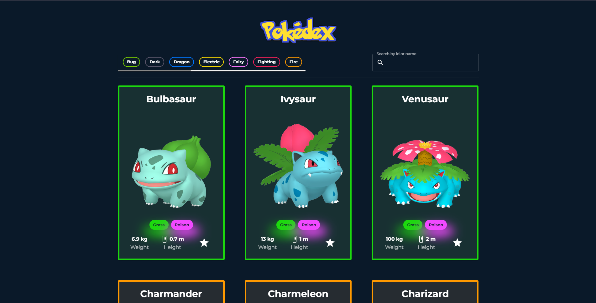

# Pokedex App

Built with React + MUI + Chart.js.



## How to start

In the project directory, you can run:

```
npm install
```

And then:

```
npm start
```

The app will be in development mode.\
Open [http://localhost:3000](http://localhost:3000) to view it in the browser.
